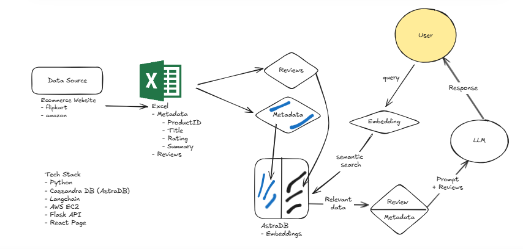

<div align="center">

# 🛍️ AI ChatBot For E-Commerce

### *Intelligent Shopping Assistant Powered by AI*

[](https://www.python.org/downloads/)
[](https://flask.palletsprojects.com/)
[](https://langchain.com/)
[](LICENSE)

[Features](#-features) • [Demo](#-demo) • [Installation](#-installation) • [Usage](#-usage) • [Tech Stack](#-tech-stack) • [Contributing](#-contributing)

</div>

---

## 📋 About The Project

An advanced **AI-powered E-Commerce Chatbot** that revolutionizes the online shopping experience by providing intelligent product recommendations, instant customer support, and natural language interactions. Built with cutting-edge AI technologies to understand customer queries and deliver personalized shopping assistance.

### 🎯 Key Highlights

- 🤖 **Smart Recommendations** - AI-driven product suggestions based on user preferences
- 💬 **Natural Conversations** - Human-like interactions using advanced NLP
- 🔍 **Intelligent Search** - Semantic search through product catalogs
- ⚡ **Fast Response** - Powered by Groq for lightning-fast inference
- 📊 **Product Reviews Analysis** - Leverages Flipkart product review dataset
- 🎨 **Beautiful UI** - Clean and modern chat interface

---

## ✨ Features

### Core Capabilities

| Feature | Description |
|---------|-------------|
| 🎯 **Smart Product Search** | Understand natural language queries and find relevant products |
| 💡 **Personalized Recommendations** | AI-powered suggestions based on user preferences and history |
| 📝 **Review Analysis** | Process and summarize product reviews for better decisions |
| 🔄 **Context Awareness** | Maintains conversation context for seamless interactions |
| 🚀 **Multi-Platform Ready** | Easily integrable with Web, WhatsApp, Telegram, and more |
| 🔐 **Secure & Scalable** | Built with security best practices and scalable architecture |

---

## 🎬 Demo



*Experience intelligent shopping assistance with natural language processing*

---

## 🛠️ Tech Stack

### Core Technologies

| Technology | Purpose |
|------------|---------|
|  | AI orchestration and chain management |
|  | High-performance vector database |
|  | Lightning-fast LLM inference |
|  | State-of-the-art embeddings |
|  | Lightweight web application |
|  | Core programming language |

### AI Components

- **LangChain** - AI application framework
- **LangChain-AstraDB** - Vector storage for semantic search
- **LangChain-Community** - Additional LangChain tools and integrations
- **LangChain-Groq** - Fast LLM inference engine
- **LangChain-HuggingFace** - Advanced text embeddings

---

## 🚀 Installation

### Prerequisites

- Python 3.10 or higher
- pip (Python package manager)
- Git
- API keys for Groq/OpenAI

### Quick Start

1️⃣ **Clone the Repository**

```bash
git clone https://github.com/sumancoder-cloud/AI-ChatBot-For-Ecommerce.git
cd AI-ChatBot-For-Ecommerce
```

2️⃣ **Create Virtual Environment** (Recommended)

```bash
# Using conda
conda create -p venv python==3.10 -y
conda activate venv/

# OR using venv
python -m venv venv
venv\Scripts\activate  # Windows
source venv/bin/activate  # Linux/Mac
```

3️⃣ **Install Dependencies**

```bash
pip install -r requirements.txt
```

4️⃣ **Configure Environment Variables**

Create a `.env` file in the root directory:

```env
# Add your API keys
GROQ_API_KEY=your_groq_api_key_here
ASTRA_DB_TOKEN=your_astra_db_token_here
ASTRA_DB_ID=your_astra_db_id_here
ASTRA_DB_KEYSPACE=your_keyspace_name

# Optional: OpenAI API Key
OPENAI_API_KEY=your_openai_api_key_here
```

5️⃣ **Run the Application**

```bash
python app.py
```

6️⃣ **Access the Chatbot**

Open your browser and navigate to:
```
http://127.0.0.1:5000
```

---

## 💻 Usage

### Starting a Conversation

1. Open the web interface at `http://127.0.0.1:5000`
2. Type your query in the chat input
3. Get instant AI-powered responses with product recommendations
4. Continue the conversation naturally

### Example Queries

- "Show me the best smartphones under ₹30,000"
- "What are customers saying about this laptop?"
- "Recommend a good camera for photography"
- "Compare these two products"

---

## 📁 Project Structure

```
AI-ChatBot-For-Ecommerce/
│
├── app.py                          # Main Flask application
├── setup.py                        # Package setup configuration
├── requirements.txt                # Project dependencies
├── .env.example                    # Environment variables template
├── .gitignore                      # Git ignore rules
│
├── ecommercebot/                   # Core bot package
│   ├── __init__.py
│   ├── data_ingest.py             # Data ingestion module
│   ├── data_converter.py          # Data processing utilities
│   └── retrieval_generation.py    # RAG implementation
│
├── dataset/                        # Training data
│   └── flipkart_product_reviews.csv
│
├── templates/                      # HTML templates
│   └── chat.html
│
├── static/                         # Static assets
│   └── style.css
│
├── notebook/                       # Jupyter notebooks
│   └── ecommerce-bot.ipynb
│
└── README.md                       # Project documentation
```

---

## 🔧 Configuration

### API Keys Required

| Service | Description | Get It From |
|---------|-------------|-------------|
| **Groq** | Fast LLM inference | [console.groq.com](https://console.groq.com) |
| **AstraDB** | Vector database | [astra.datastax.com](https://astra.datastax.com) |
| **OpenAI** (Optional) | Alternative LLM provider | [platform.openai.com](https://platform.openai.com) |

---

## 🤝 Contributing

Contributions make the open-source community an amazing place to learn, inspire, and create! Any contributions you make are **greatly appreciated**.

### How to Contribute

1. 🍴 Fork the Project
2. 🌿 Create your Feature Branch
   ```bash
   git checkout -b feature/AmazingFeature
   ```
3. 💾 Commit your Changes
   ```bash
   git commit -m 'Add some AmazingFeature'
   ```
4. 📤 Push to the Branch
   ```bash
   git push origin feature/AmazingFeature
   ```
5. 🎉 Open a Pull Request

### Development Guidelines

- Write clean, documented code
- Follow PEP 8 style guidelines
- Add tests for new features
- Update documentation as needed

---

## 📄 License

Distributed under the **MIT License**. See `LICENSE` for more information.

---

## 👨‍💻 Author

**Suman Yadav**

- 📧 Email: [sumancoder.cloud@gmail.com](mailto:sumancoder.cloud@gmail.com)
- 🐙 GitHub: [@sumancoder-cloud](https://github.com/sumancoder-cloud)
- 💼 LinkedIn: [Connect with me](https://www.linkedin.com/in/sumancoder-cloud)

---

## 🙏 Acknowledgements

- [LangChain](https://langchain.com/) - For the amazing AI framework
- [Groq](https://groq.com/) - For lightning-fast LLM inference
- [DataStax AstraDB](https://www.datastax.com/products/datastax-astra) - For vector database capabilities
- [HuggingFace](https://huggingface.co/) - For state-of-the-art embeddings
- [Flask](https://flask.palletsprojects.com/) - For the web framework
- All contributors who helped improve this project

---

## 📊 Dataset

This project uses the **Flipkart Product Reviews Dataset** for training and recommendations. The dataset contains product information and customer reviews from Flipkart.

---

## 🔮 Future Enhancements

- [ ] Multi-language support
- [ ] Voice interaction capabilities
- [ ] Advanced product comparison features
- [ ] Integration with more e-commerce platforms
- [ ] Mobile application
- [ ] Real-time inventory tracking
- [ ] Price drop alerts

---

## 📈 Project Stats


---

<div align="center">

### ⭐ Star this repository if you find it helpful!

**Made with ❤️ by Suman Yadav**

</div>
